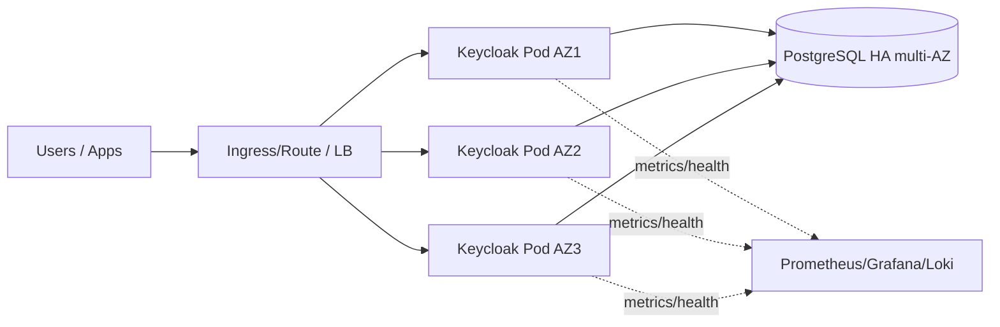

# Architecture de référence “entreprise” : HA multi‑AZ (single-cluster)

## Objectif
Résister à la perte d’une AZ **dans une même région** (sans PRA multi‑région).

Le benchmark Keycloak indique que multi‑AZ (faible latence intra‑région) est adapté,
et déconseille de déployer Keycloak “across different regions” (latence).  
Réf : https://www.keycloak.org/2025/10/keycloak-benchmark

---

## Architecture (vue logique)

---

## Choix “prod”
- Déploiement via **Operator** (K8s/OpenShift)  
  Réf : https://www.keycloak.org/operator/installation
- DB externe **PostgreSQL** (managée si possible)  
  Réf : https://www.keycloak.org/server/db
- **Hostname** obligatoire (issuer stable) + reverse-proxy correctement configuré  
  Réf : https://www.keycloak.org/server/hostname
- Health/metrics sur management port `9000` (ne pas exposer via proxy)  
  Réfs :
  - https://www.keycloak.org/server/management-interface
  - https://www.keycloak.org/server/reverseproxy
- Sessions Keycloak 26 : “persistent sessions” (DB + cache)  
  Réf : https://www.keycloak.org/2024/12/storing-sessions-in-kc26

---

## Sizing initial (point de départ)
> Ajuster ensuite avec métriques + test charge.

- Pods Keycloak : **3** (1 par AZ) minimum.
- Ressources (par pod) : point de départ **1–2 vCPU / 2–4 GiB**.
- DB : PostgreSQL HA multi-AZ (IOPS/CPU dimensionnés pour le pool total).
- Pool DB : fixer initial=min=max (taille fixe)  
  Réf : https://www.keycloak.org/high-availability/single-cluster/concepts-database-connections

---

## Contrôles indispensables
- Anti-affinity (spread pods sur AZ)
- PDB (éviter eviction simultanée)
- Rolling upgrades (Operator) + stratégie de rollback
- Sauvegardes DB testées (restore) + export realm (option)

Checklist complète : `checklists.md`
